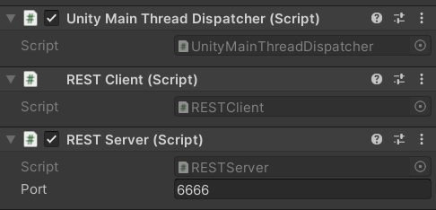

# InlineRESTApiForUnity 

InlineRestApiForUnity is a set of classes for creating REST servers and clients in Unity. This project provides convenient tools for making RESTful HTTP requests, handling JSON serialization, and defining routes for server-side request handling.

A key feature of this REST API is that almost everything is handled inline, with server routes and client requests defined directly in code. This simplifies the setup and keeps your project clean and efficient.

## Installation

1. Install dependencies
2. Download the repository as a zip file.
3. Extract the contents to any folder in your Unity project.

### Dependencies

- [UnityMainThreadDispatcher](https://github.com/PimDeWitte/UnityMainThreadDispatcher)
- NuGet package [Newtonsoft.json](https://www.nuget.org/packages/newtonsoft.json/) installed via [NuGetForUnity](https://github.com/GlitchEnzo/NuGetForUnity)

## Usage and Examples



_RESTClient and RESTServer in Inspector_

### RESTClient

RESTClient is a MonoBehaviour component for making RESTful HTTP requests. It supports GET and POST methods with JSON serialization and deserialization.

This component should be attached to a GameObject in the scene. Ideally, this GameObject should be positioned near the top of the scene's hierarchy

#### Example:

_ChatMessage.cs_

```csharp
public enum MessageType
{
    User,
    System
}

public class ChatMessage
{
    public MessageType Type { get; set; }
    public string Content { get; set; }
    public DateTime Timestamp { get; set; }

    public ChatMessage(MessageType type, string content, DateTime timestamp)
    {
        Type = type;
        Content = content;
        Timestamp = timestamp;
    }
}
```

_ExampleClient.cs_

```csharp

...

void Start()
{
    // Create a URI for the chat API
    // MainServerApiUri here - is some base URL
    var resourceUri = new Uri(new Uri(MainServerApiUri), "Chat");

    // GET request
    RESTClient.Instance.Get<ChatMessage[]>(resourceUri.ToString(),
        success: (ChatMessage[] result) =>
        {
            Debug.Log("Received messages: " + result.Length);
        },
        error: (UnityWebRequest webRequest) =>
        {
            Debug.LogError("GET request error: " + webRequest.error);
        });

    // POST request
    RESTClient.Instance.Post<ChatMessage>(resourceUri.ToString(), 
        new ChatMessage(MessageType.User, "Hello, world!", DateTime.Now),
        success: (UnityWebRequest webRequest) =>
        {
            Debug.Log("Message sent successfully");
        },
        error: (UnityWebRequest webRequest) =>
        {
            Debug.LogError("POST request error: " + webRequest.error);
        });
}

...

```

#### Explanation:

- resourceUri — the URI of the resource being accessed. In this example, it's the chat API endpoint.
- Get<T> — a method for performing a GET request. Here, the request retrieves an array of messages ChatMessage[].
- Post<T> — a method for performing a POST request. In this example, it sends a message of type ChatMessage.
- The success and error callbacks handle the result of the request, either successful or failed.

### RESTServer

RESTServer is a class for creating a REST server in Unity. It handles HTTP requests and routes defined by the user.

#### Example 1: Using RouteParams

_ExampleServer.cs_

```csharp
...

void Awake()
{
    AddRoute(new Route("api/{object_id}/color/",
        Get: new HttpMethodDelegateWrapper<string, string>
            (async (RouteParams RouteParams, string Data) =>
        {
            Debug.Log("Get!\nRP:" + RouteParams.PathParams["object_id"]
                        + "\nQP:" + RouteParams.QueryParams["hex"]);

            return @"{'return': 'value'}";
        }),
        Post: new HttpMethodDelegateWrapper<string, string>
        (async (RouteParams RouteParams, string Data) =>
        {
            Debug.Log("Post!\nData:" + Data);

            return "Success!";
        })
    ));
}

...

```

##### Testing with curl:

- GET request:

```bash
curl -X get localhost:6666/api/cube/color/?hex=c0ffee
```

Response:

```csharp
{'return': 'value'}
```

- POST request:

```bash
curl -X post localhost:6666/api/cube/color/ -d "{id: 12345678}"
```

Response:

```text
Success!
```

#### Explanation:

- AddRoute — a method for adding a route to the server. In this example, the route /api/{object_id}/color/ handles both GET and POST methods.
- In the GET request, we extract both the path parameters (PathParams) and query parameters (QueryParams).
- The POST request processes the data sent in the body of the request

#### Example 2: JSON Serialization

_ExampleServerWithSerialization.cs_

```csharp

...

public void Awake()
{
    /*
    ThreadingHelper is used here because ExpressionController.PlayExpression 
    interacts with the Animator component, which must be accessed on the 
    main thread. However, using such workarounds can negatively impact 
    performance, so it's important to use them carefully and only when 
    necessary to avoid potential slowdowns.
    */

    Server.AddRoute(new Route("api/avatar/expression/",
        Get: new HttpMethodDelegateWrapper<String, string[]>
            (async (RouteParams RouteParams, string Data) =>
            {
                var ExpressionList = await ThreadingHelper.RunInMainThread<string[]>(
                        ExpressionController.GetExpressionsList);

                Debug.Log("Sending expression list...");

                return ExpressionList;
            }),
        Post: new HttpMethodDelegateWrapper<Dictionary<string, string>, Dictionary<string, string>>
            (async (RouteParams RouteParams, Dictionary<string, string> Data) =>
            {
                var ExpName = Data["expression_name"];

                await ThreadingHelper.RunInMainThread(() => ExpressionController.PlayExpression(ExpName));

                var msg = $"Set expression: {ExpName}";

                Debug.Log(msg);

                return new Dictionary<string, string>
                {
                    { "status", msg }
                };
            })
    ));
}

...

```

_ExpressionController.cs_

```csharp
public static class ExpressionController
{
    private static string[] expressions = { "neutral", "angry", "joy", "fun", "sorrow", "suprised" };

    public static string[] GetExpressionsList()
    {
        return expressions;
    }

    public static void PlayExpression(string expressionName)
    {
        Debug.Log($"Playing expression: {expressionName}");
        // Logic for displaying the facial expression using Animator
        // ...
    }
}
```

##### Testing with curl:

- GET request:

```bash
curl -X get localhost:6666/api/avatar/expression/
```

Response:

```csharp
["neutral","angry","joy","fun","sorrow","suprised"]
```

- POST request:

```csharp
curl -X post localhost:6666/api/avatar/expression/ -d "{'expression_name': 'joy'}"
```

Response:

```csharp
{"status":"Set expression: joy"}
```

- The server processes and returns JSON data.
- ExpressionController here is an example class that manages avatar facial expressions in 3D model Avatar

### Supporting Classes:

+ ThreadingHelper — a helper class for executing tasks on the Unity main thread.

